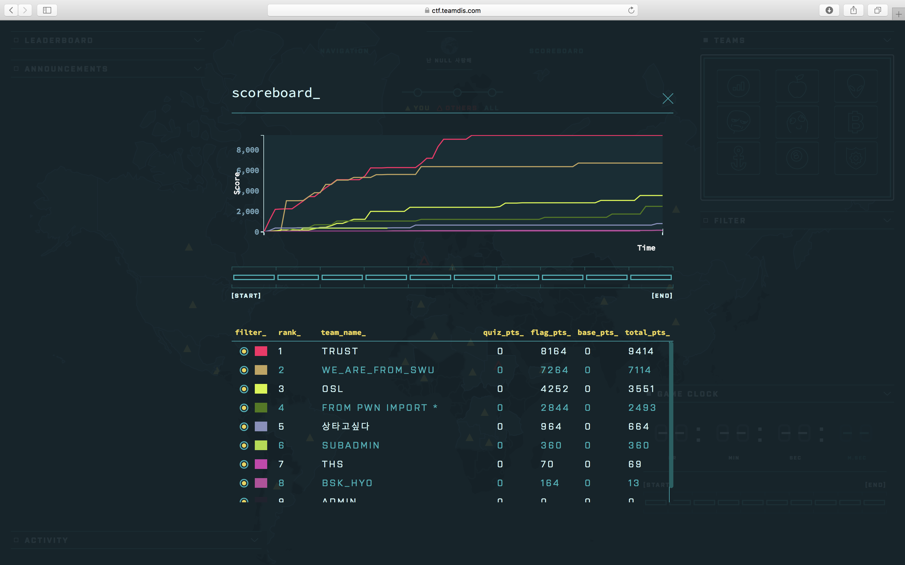
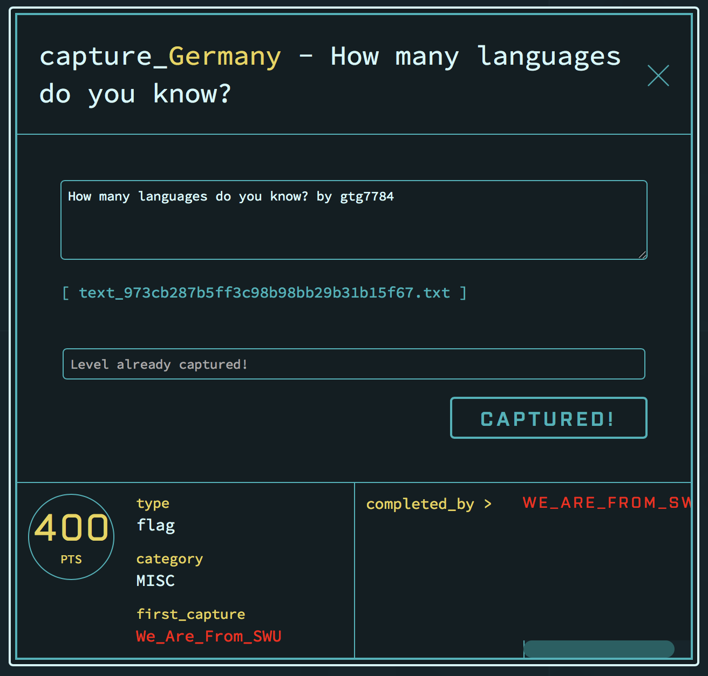
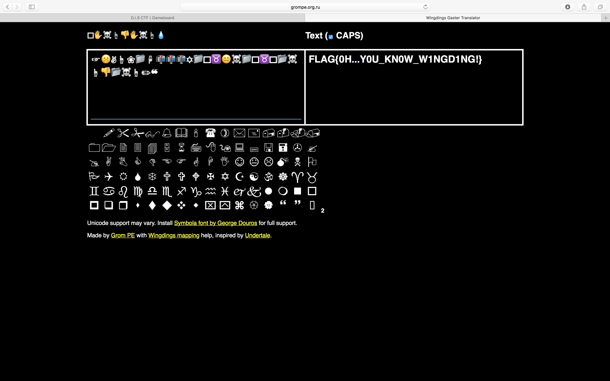
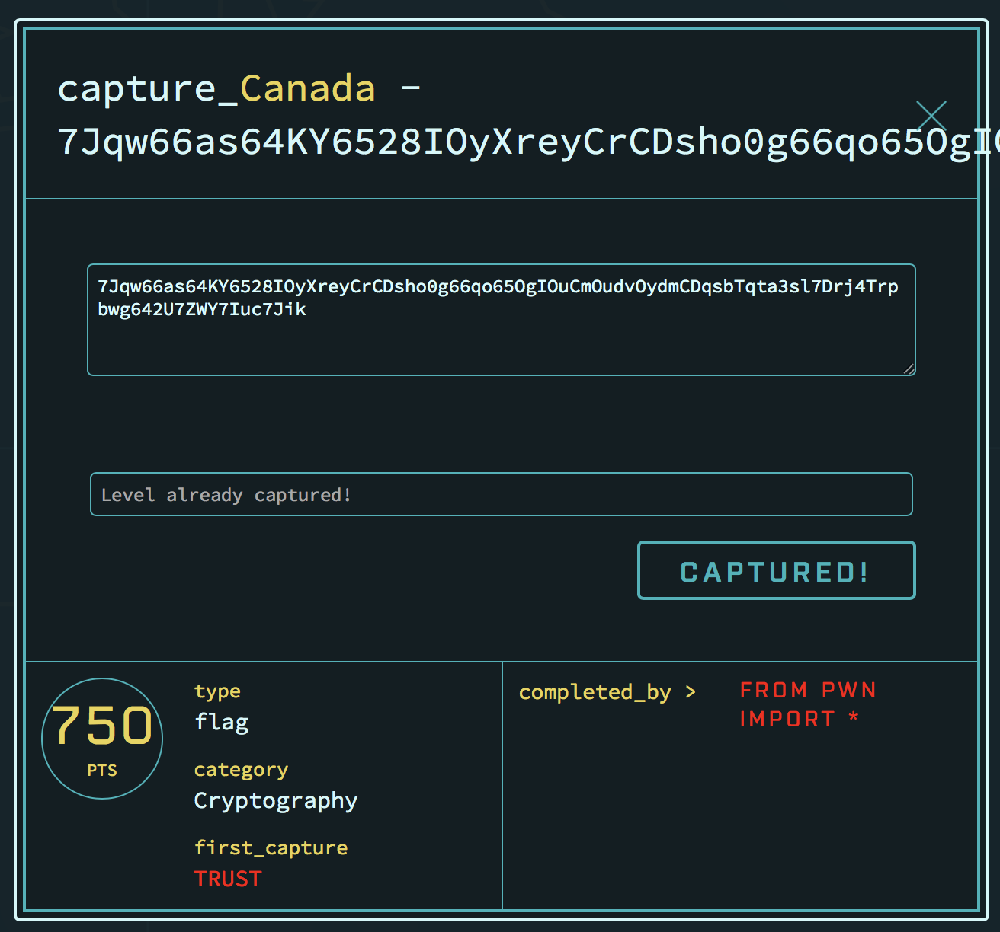
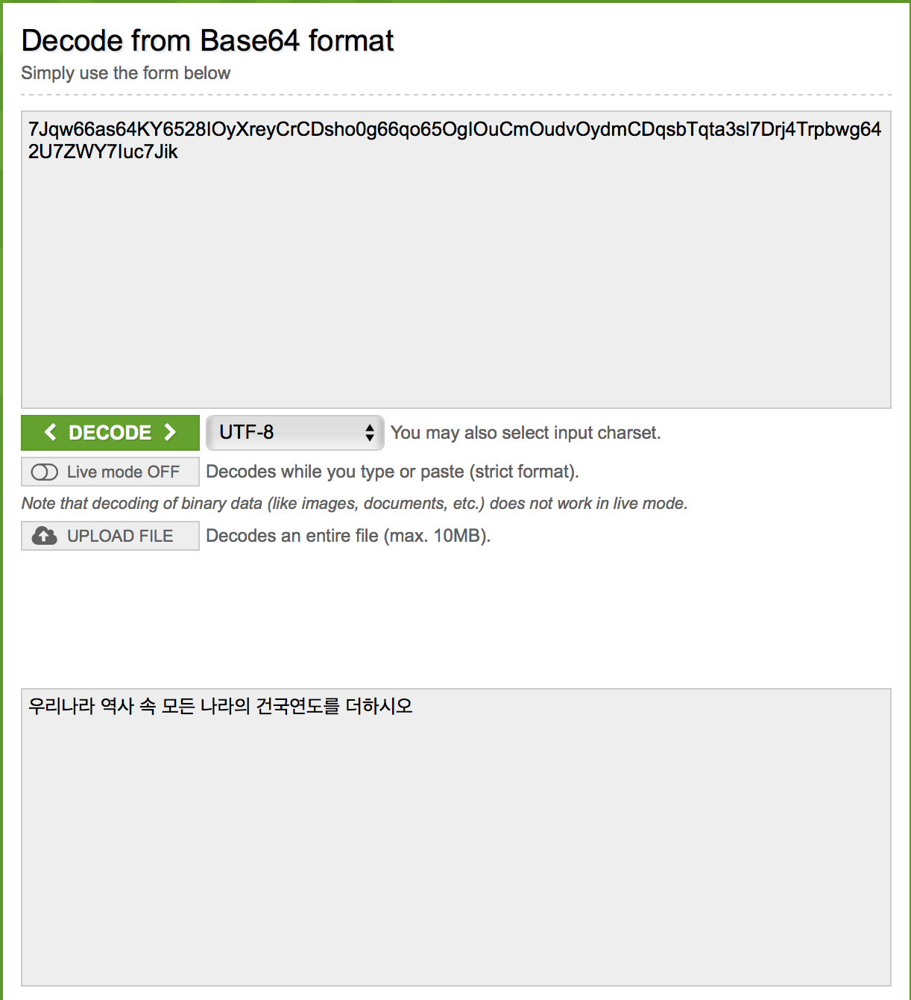
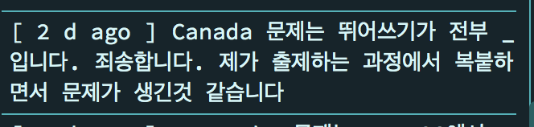
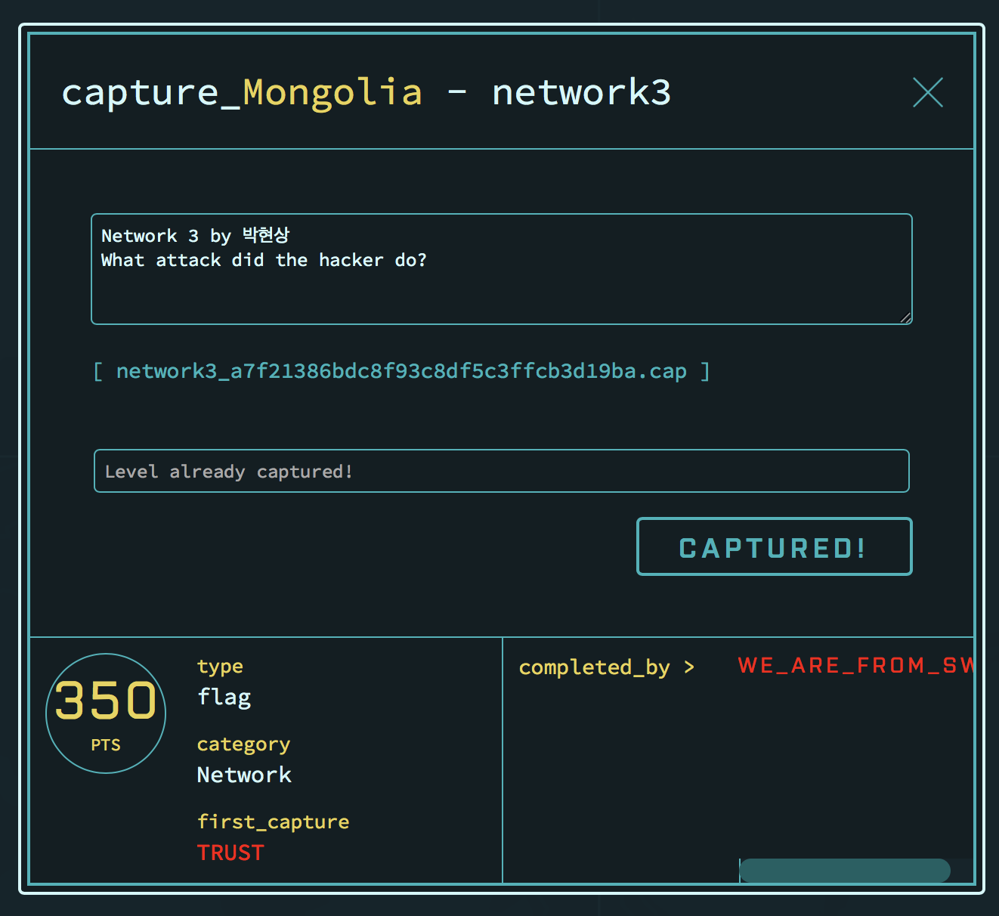
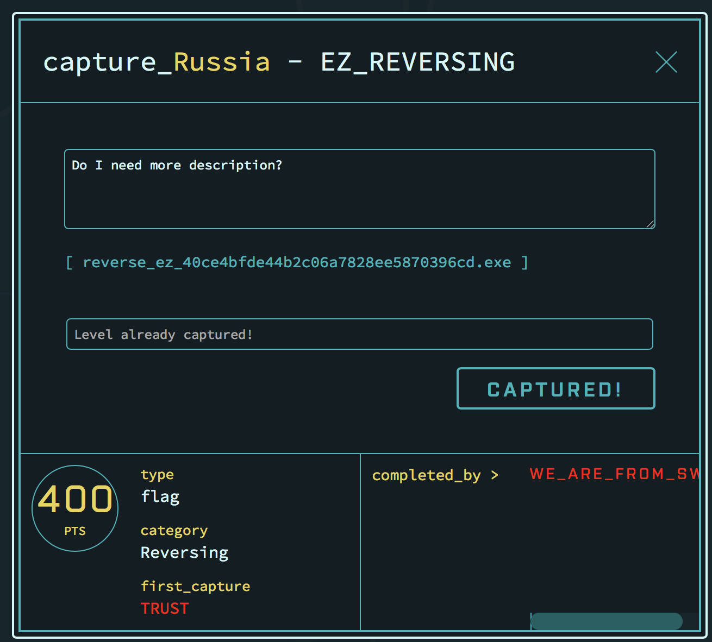
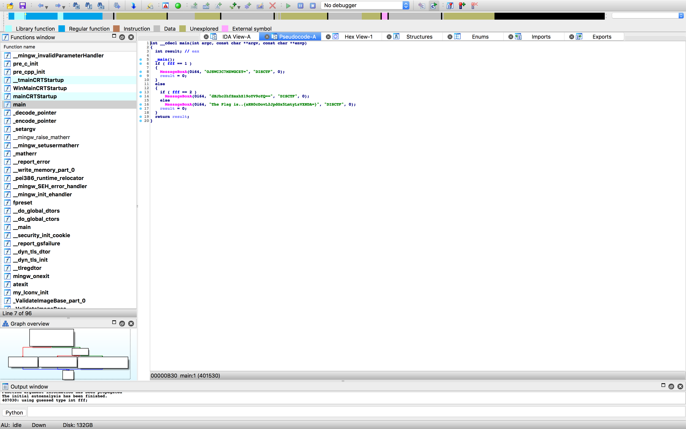
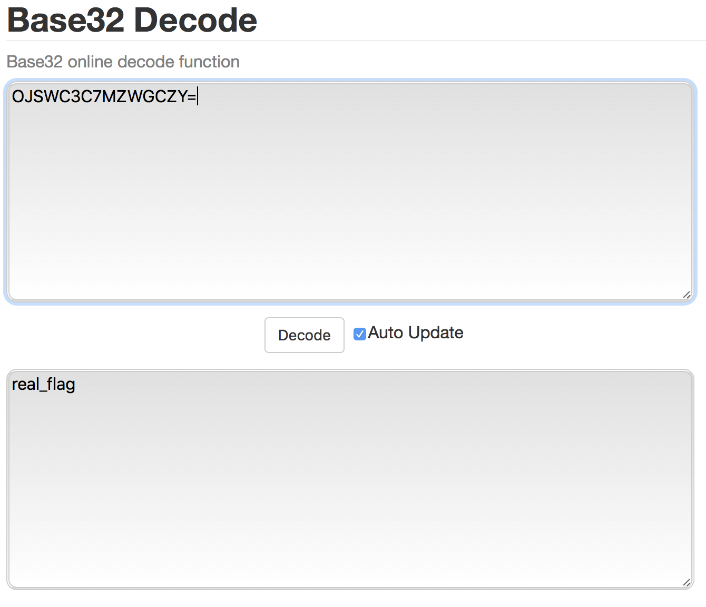

DISCTF Write-Ups
=================
We_Are_From_SWU gtg7784(2위)
----------------------------
저희 팀(We_Are_From_SWU)이 푼 24문제 중에서 4문제를 풀었습니다!

How many languages do you know? - MISC
-------------------------------

후 내가만든 문제다! 0solve 기대했지만 2solve... 아쉽다

사진에는 우리팀만 풀었다고 되어있지만 문제 플래그 인증이 안되서 TRUST, FROM PWN IMPORT *, 우리팀 총 3 solve다. 
~~TRUST에 이동준형이 대회 끝나기 전까지 문제 0sovle면 때린댔는데 다행이다... 무서웠다~~

문제를 보면 text_973cb287b5ff3c98b98bb29b31b15f67.txt 라는 파일이 들어 있는데 파일 안에 <pre><code>☞☹✌☝❀📁☟📬📬📬✡📁🕆♉😐☠📁🕈♉🕈📂☠☝👎📂☠☝✏❝</code></pre>  이런 이모지들이 잔뜩있다. 이 이모지들을 wingdings 언어 번역기로 돌리면 FLAG가 뜬다.

**FLAG : 0H...Y0U_KN0W_W1NGD1NG!**

Jqw66as64KY6528IOyXreyCrCDsho0g66qo65OgIOuCmOudvOydmCDqsbTqta3sl7Drj4Trpbwg642U7ZWY7Iuc7Jik - Cryptography
------------------

크립토 문제다!

문제 자체가 문제인거같아서 base64를 decode하니 <pre><code>우리나라 역사 속 모든 나라의 건국연도를 더하시오</code></pre>라는 결과가 나왔다.

그래서 구글 찾아보면서 뭐 어떻게 해도 안되길레 포기했다가, 중간에 공지가 있길레 봤더니

라길레 설마 <pre><code>우리나라 역사 속 모든 나라의 건국연도를 더하시오</code></pre>이게 답인가 싶어서 <pre><code>우리나라_역사_속_모든_나라의_건국연도를_더하시오</code></pre> 를 넣었더니 FLAG였다.

**FLAG : 우리나라_역사_속_모든_나라의_건국연도를_더하시오**

Network 3 - Network
==========

난 네트워크 알못이다.
진짜 네트워크라곤 와이파이밖에 모르는 사람인데 network 3 문제를 다 못풀길레 봤더니 그냥 공격 종류 맞추기 였다.

구글에 2018 network attack, owasp network attack 등등 검색하다가 맞췄다.

~~원래는 <pre><code>network3_a7f21386bdc8f93c8df5c3ffcb3d19ba.cap</code></pre> 이 파일 wireshark로 따서 맞춰야 되는건데 따긴했는데 뭔내용인지 몰라서 패스~~~

 **FLAG : port scan**

 EZ_REVERSING - Reversing
 ==============

 

 립싱문제다. <pre><code>reverse_ez_40ce4bfde44b2c06a7828ee5870396cd.exe</code></pre> 이파일을 ida로 돌리면 되는데 가장 처음 잡았던 문제이자 종료 10분 남기고 푼 문제였다.

 ida를 넣고 핵스레이를 돌려보자.

 

 대놓고 답이있는데 3개나 있다.
 
<pre>
<code>OJSWC3C7MZWGCZY=</code>
<code>dHJhc2hfZmxhZ19oYV9oYQ==</code>
<code>aHR0cDovL2JpdGx5LmtyLzVXNDA=</code>
</pre>

셋다 base64인줄알고 decode했는데, 첫번째는 문자가 깨지고 두번째는 fake flag,세번째는 http://bitly.kr/5W40가 뜨길레 드갔더니 나무위키 ~~페이크다 이 병신들아~~ 였다.

그래서 접어뒀다가 여준호도 포기하길레 첫번째꺼를 base32에 넣었는데 플래그가 떴다.

**FLAG : real_flag**

