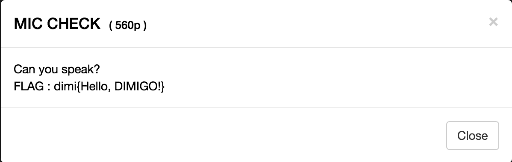
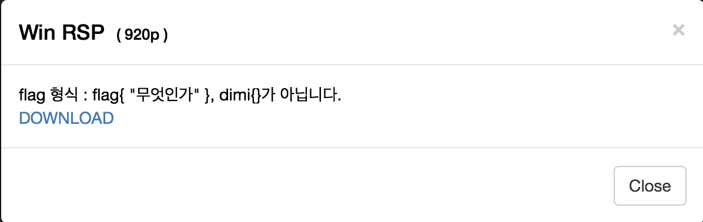
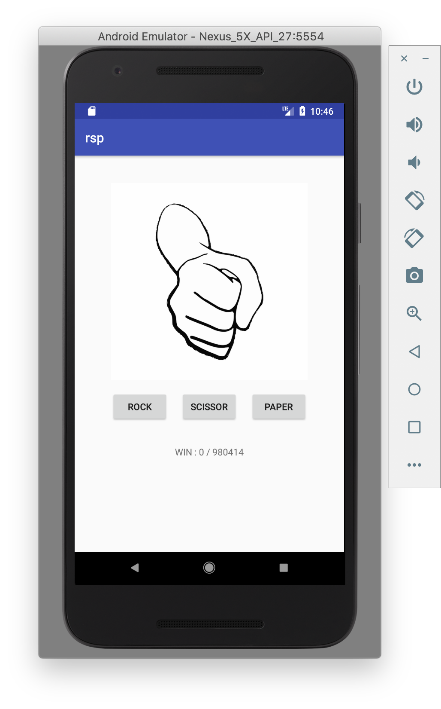
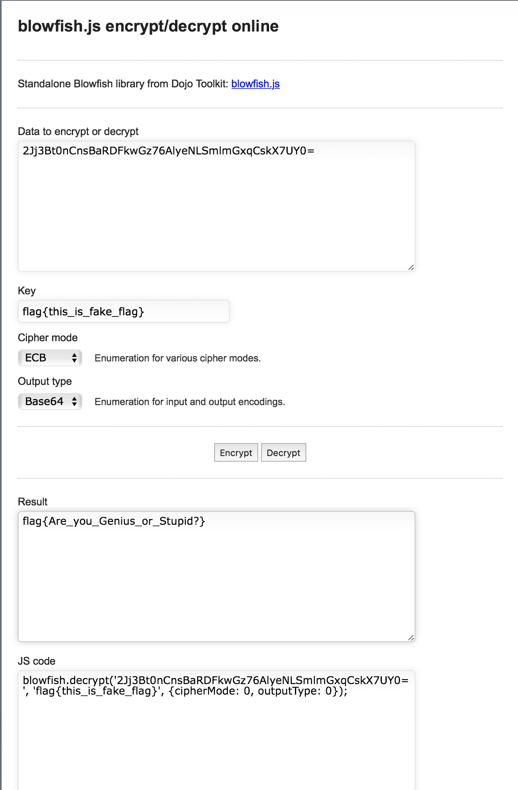

KDMHSCTF 2018 Write-Ups
======================
gtg7784(19위)
----------------------
두 문제밖에 못풀었지만 운 좋게 1480p로 19등을 했읍니다. 첫 롸업이라 많이 부족해도 읽어주세요!

MIC CHECK
-----------

문제에 있는 dimi{Hello, DIMIGO!}를 flag 인증칸에 넣으면 된다.

Win RSP
---------

첨엔 rsp가 뭐지? 하면서 win rsp 구글링 겁나 했는데 android studio에 있는 AVD로 실행하니까 가위바위보가 뜨길레 이제야 rsp가 Rock Scissors Paper이란걸 알았다. 

처음엔 그냥 막 눌러보다가 rsp.apk를 디컴파일 하면 되겠다 싶어서 http://www.javadecompilers.com/apk 여기에서 rsp.apk를 디컴파일했다. 먼저 MainActivity.java를 들어갔다.

<pre>
package kr.hs.dimigo.ctf.rsp.rsp;

import android.content.Intent;
import android.os.Bundle;
import android.support.v7.app.AppCompatActivity;
import android.view.View;
import android.widget.TextView;

public class MainActivity extends AppCompatActivity {
    private int win = 0;

    protected void onCreate(Bundle savedInstanceState) {
        super.onCreate(savedInstanceState);
        setContentView((int) C0219R.layout.activity_main);
    }

    public void battle(View v) {
        int computer = ((int) (Math.random() * 10.0d)) % 3;
        if (computer == 0) {
            this.win++;
            ((TextView) findViewById(C0219R.id.txt_status)).setText("Win!");
        } else if (computer == 1) {
            this.win = 0;
            ((TextView) findViewById(C0219R.id.txt_status)).setText("Draw!");
        } else {
            this.win = 0;
            ((TextView) findViewById(C0219R.id.txt_status)).setText("Lose!");
        }
        ((TextView) findViewById(C0219R.id.txt_win)).setText("WIN : " + this.win + "/980414");
        if (this.win == 980414) {
            Intent intent = new Intent(getApplicationContext(), WinActivity.class);
            intent.putExtra("score", this.win);
            startActivity(intent);
        }
    }
}
</pre>

그럼 밑 부분에 980414번 이기면 어떤 동작을 하는지 적혀있다.

<pre>
((TextView) findViewById(C0219R.id.txt_win)).setText("WIN : " + this.win + "/980414");
        if (this.win == 980414) {
            Intent intent = new Intent(getApplicationContext(), WinActivity.class);
            intent.putExtra("score", this.win);
            startActivity(intent);
        }
</pre>

이렇게 980414번 이기면 WinActivity를 실행한다고 적혀있다. WinActivity.java에 들어가 보자.

<pre>
package kr.hs.dimigo.ctf.rsp.rsp;

import android.os.Bundle;
import android.support.v7.app.AppCompatActivity;
import android.util.Base64;
import android.util.Log;
import android.widget.TextView;
import java.io.IOException;
import javax.crypto.Cipher;
import javax.crypto.spec.SecretKeySpec;
import org.jsoup.Jsoup;

public class WinActivity extends AppCompatActivity {

    class C02211 implements Runnable {
        C02211() {
        }

        public void run() {
            String string = "";
            try {
                string = Jsoup.connect("http://ctf.dimigo.hs.kr/2c3fa05a103d78ccf08c4df3c00dedda/flag.php").get().toString().split(";")[1];
                Log.e("JTJ", string);
            } catch (IOException e) {
                string = "Error : " + e.getMessage();
            }
            try {
                SecretKeySpec key = new SecretKeySpec("flag{this_is_fake_flag}".getBytes(StringEncodings.UTF8), "Blowfish");
                Cipher cipher = Cipher.getInstance("Blowfish/ECB/PKCS5Padding");
                cipher.init(2, key);
                string = new String(cipher.doFinal(Base64.decode(string.getBytes(StringEncodings.UTF8), 0)));
            } catch (Exception e2) {
                string = "Error : " + e2.getMessage();
            }
            final String finalString = string;
            WinActivity.this.runOnUiThread(new Runnable() {
                public void run() {
                    ((TextView) WinActivity.this.findViewById(C0219R.id.text)).setText(finalString);
                }
            });
        }
    }

    protected void onCreate(Bundle savedInstanceState) {
        int score;
        super.onCreate(savedInstanceState);
        setContentView((int) C0219R.layout.activity_win);
        Bundle bundle = getIntent().getExtras();
        if (bundle == null) {
            score = 0;
        } else {
            score = bundle.getInt("score");
        }
        if (score < 980414) {
            onDestroy();
        } else {
            getWebsite();
        }
    }

    private void getWebsite() {
        new Thread(new C02211()).start();
    }
}
</pre>

이 코드의 시작부터 알 수 있듯이,

<pre>
try {
                string = Jsoup.connect("http://ctf.dimigo.hs.kr/2c3fa05a103d78ccf08c4df3c00dedda/flag.php").get().toString().split(";")[1];
                Log.e("JTJ", string);
            } catch (IOException e) {
                string = "Error : " + e.getMessage();
            }
</pre>

이 코드를 실행하면 먼저 http://ctf.dimigo.hs.kr/2c3fa05a103d78ccf08c4df3c00dedda/flag.php 이 링크에서 문자를 받아온다. 

;2Jj3Bt0nCnsBaRDFkwGz76AlyeNLSmlmGxqCskX7UY0=;

split(“;”)이기 때문에 ;을 없애면

2Jj3Bt0nCnsBaRDFkwGz76AlyeNLSmlmGxqCskX7UY0=

이 된다. 코드를 보면 이 문자를 key는 flag{this_is_fake_flag}로  blowfish 알고리즘을 이용해서 풀면 될거 같아서 intelliJ에 Blowfish.java만 넣고 빌드를 했는데, 안드로이드 코드라 그런지 컴파일이 안됐다.

구글링을 엄청 하다가 blowfish.js를 찾고 http://sladex.org/blowfish.js/ 여기서 decrypt를 하니

flag{Are_you_Genius_or_Stupid?}가 나왔다.
